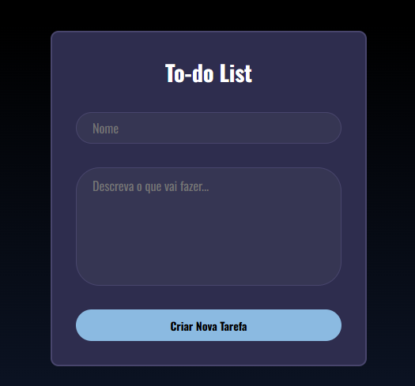

<h1 align="center">To-do List — Projeto Pessoal </h1>

Essa aplicação consiste em uma API, que permite com que o usuário crie e personalize a sua própria lista de tarefas.

Este  projeto de software, implementa tecnologias React e Vite, que demonstram agilidade,eficiencia, e flexibilidade para o processo de desenvolvimento do Front. Ele conta com a integração de bibliotecas nativas do Node.js como express, sqlLite3 para privatizar as informações locais dos usuários, e garantir praticidade na fase de teste da aplicação. 

### Screenshot



## My Process

### **1. Baixe ou clone o repositório**
```sh
git clone https://github.com/Luanpierote/To-do-List.git
cd To-do-List
```

### **2. Instalando dependências**
**Backend:**
```sh
cd server
npm i -y
```
Dependências principais:
```sh
express
cors
better-sqlite3
```

**Frontend:**
```sh
cd client
npm i -y
```
Dependências principais:
```sh
react
react-dom
axios
vite
```

### **3. Como Rodar o Projeto**
**Server:**
```sh
cd server
npm run dev
```

**Client:**
```sh
cd client
npm run dev
```

## Built with

- HTML5 
- CSS3
- JavaScript (ES6 Modules)
- Express
- Manipulação de DOM
- Better-sqlite3
- Propriedades personalizadas CSS
- Desktop-first workflow

### **Frontend (client/)**
- React
- Vite
- Axios
- CSS puro

### **Backend (server/)**
- Node.js
- Express
- SQLite3 (better-sqlite3)
- CORS

## Continued development

Futuramente, pretendo adicionar novas funções utilitárias no sistema. Como por exemplo, um módulo que permita o usuário definir um prazo para as suas atividade e que acompanhe o andamento das taréfas por meio da data e hora do dia, detectando se o mesmo concluiu essa taréfa no prazo correto.

## Author

- Website - [Luan](https://luanpierote.netlify.app/)
- GitHub - [@Luanpierote](https://github.com/LuanPierote)


